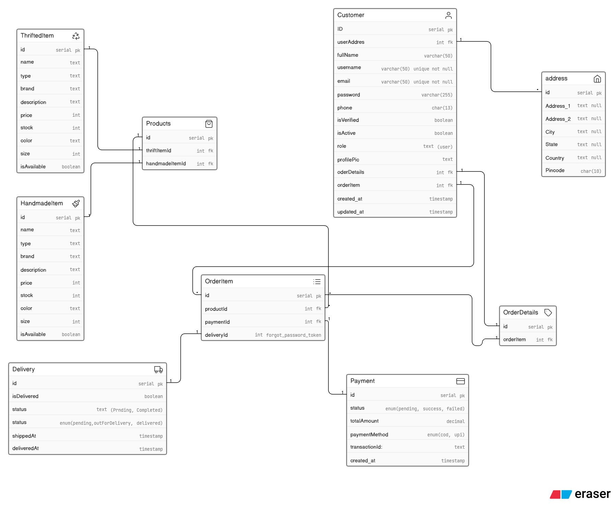
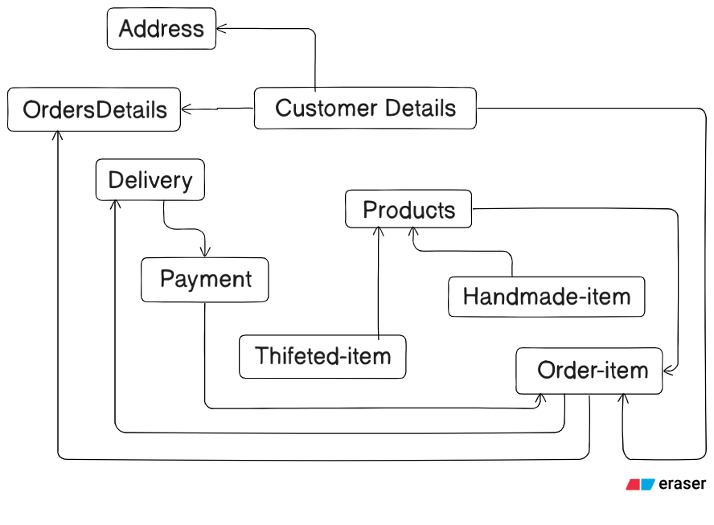

## Database Design Approach

First, I carefully understood the problem statement — what the actual problem is and what kind of requirements a small creator has. The goal was to build a system where the creator can manage their products, track orders, and handle basic operations efficiently.

After understanding the requirements, I started designing an ER (Entity-Relationship) model based on what I have learned so far. I tried to apply my knowledge in a practical way.

Then, I spent a good amount of time thinking about how different entities are connected to each other. Designing relationships between entities was a bit confusing at first, but with time and practice, I was able to figure it out and implement it properly.

This process helped me understand how real-world problems are translated into database design. You can check the diagram to see how everything is structured.

